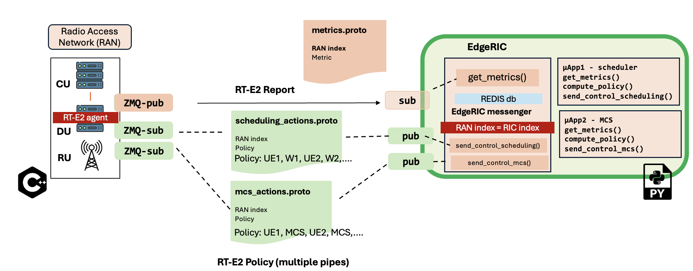

Refer to ``docker/`` for the multi container solution  

## Current Implementation
  


## Build the EdgeRIC compatible srsRAN network
```bash
sudo apt-get update
sudo apt-get -y upgrade

sudo apt-get install -y libfftw3-dev libmbedtls-dev libsctp-dev qt5-default libconfig++-dev net-tools nano libtool pkg-config build-essential autoconf automake git python3 python3-distutils python3-pip python3-apt libzmq3-dev python3-zmq software-properties-common

sudo apt-get update
sudo add-apt-repository ppa:gnuradio/gnuradio-releases
sudo apt-get update
sudo apt-get install -y gnuradio xterm python3-gi gobject-introspection gir1.2-gtk-3.0 iputils-ping iproute2 libx11-dev iperf

sudo pip3 install --upgrade pip

sudo pip3 install gym pandas torchvision tensorboard redis debugpy ray gymnasium dm_tree pyarrow typer scikit-image plotly
sudo pip3 install hydra-core==1.1.0

sudo pip3 uninstall -y protobuf
sudo pip3 install protobuf==3.20.*

git clone https://github.com/ucsdwcsng/EdgeRIC-on-5G.git
cd EdgeRIC-on-5G
git checkout srsran

sudo ./make-ran-er.sh
```
# Run the Network
## Core Network
### Open5gs installation on Ubuntu 20
Official documentation: [open5gs-quickstart](https://open5gs.org/open5gs/docs/guide/01-quickstart/)
```bash
sudo apt update
sudo apt install gnupg
curl -fsSL https://pgp.mongodb.com/server-6.0.asc | sudo gpg -o /usr/share/keyrings/mongodb-server-6.0.gpg --dearmor
echo "deb [ arch=amd64,arm64 signed-by=/usr/share/keyrings/mongodb-server-6.0.gpg] https://repo.mongodb.org/apt/ubuntu focal/mongodb-org/6.0 multiverse" | sudo tee /etc/apt/sources.list.d/mongodb-org-6.0.list
sudo apt update
sudo apt install -y mongodb-org
sudo systemctl start mongod
sudo systemctl enable mongod
sudo add-apt-repository ppa:open5gs/latest
sudo apt update
sudo apt install open5gs

# Install webui
sudo apt update
sudo apt install -y ca-certificates curl gnupg
sudo mkdir -p /etc/apt/keyrings
curl -fsSL https://deb.nodesource.com/gpgkey/nodesource-repo.gpg.key | sudo gpg --dearmor -o /etc/apt/keyrings/nodesource.gpg

 # Create deb repository
NODE_MAJOR=20
echo "deb [signed-by=/etc/apt/keyrings/nodesource.gpg] https://deb.nodesource.com/node_$NODE_MAJOR.x nodistro main" | sudo tee /etc/apt/sources.list.d/nodesource.list

 # Run Update and Install webui
sudo apt update
sudo apt install nodejs -y
curl -fsSL https://open5gs.org/open5gs/assets/webui/install | sudo -E bash -
``` 
Run the following commands:  
```bash
$ sudo systemctl restart open5gs-mmed
$ sudo systemctl restart open5gs-sgwcd
$ sudo systemctl restart open5gs-smfd
$ sudo systemctl restart open5gs-amfd
$ sudo systemctl restart open5gs-sgwud
$ sudo systemctl restart open5gs-upfd
$ sudo systemctl restart open5gs-hssd
$ sudo systemctl restart open5gs-pcrfd
$ sudo systemctl restart open5gs-nrfd
$ sudo systemctl restart open5gs-scpd
$ sudo systemctl restart open5gs-seppd
$ sudo systemctl restart open5gs-ausfd
$ sudo systemctl restart open5gs-udmd
$ sudo systemctl restart open5gs-pcfd
$ sudo systemctl restart open5gs-nssfd
$ sudo systemctl restart open5gs-bsfd
$ sudo systemctl restart open5gs-udrd
$ sudo systemctl restart open5gs-webui
```
**how to know open5gs is installed?**  
Run ``ps aux | grep open5gs`` --> this will show 16 active processes  
**Where are open5gs configs located?**  
``~/etc/open5gs`` --> folder contains all config files as .yaml --> to write, you need to change permission --> ``sudo chmod a+w ~/etc/open5gs/``  
This repository contains all the open5gs configs used in folder ``open5gs``  
**How to update UE data base on open5gs core network?**  
``http://localhost:9999`` --> username: admin, password: 1423, add all UE sim credentials, press ``Add a subscriber``
 
## Radio Access Network

### Running in over the air mode 
Make sure you have UHD installed   
**Run the srsRAN**  
```bash
sudo ./run_gnb_ota.sh
```
**Run User Equipments (srsue) with USRP**  
Update the UE config files, update ``[rf]`` section with the following, [refer here](https://docs.srsran.com/projects/project/en/latest/tutorials/source/srsUE/source/index.html#over-the-air-setup):  
``device_name = uhd``  
``device_args = ip_addr_of_sdr`` 

### Running in zmq mode (virtual radios)

**GNU flowgraph - (Terminal 1)**  
Run the GNU radio flowgraph - for two UEs run:
```bash
python3 2ue-zmq-mode-23.04Mhz.py
```
Run the GNU radio flowgraph - for four UEs run:
```bash
python3 4ue-zmq-mode-23.04Mhz.py
```
**Run the srsRAN - (Terminal 2)**
```bash
sudo ./run_gnb_multi_ue.sh
```
Press ``t`` to see the network metrics  
**Run User Equipments (srsue) in zmq mode - - (Terminal 3)**  
For two UEs, you can run the script:
```bash
sudo ./run2ue-zmq-mode.sh
```
For four UEs, you can run the script:
```bash
sudo ./run4ue-zmq-mode.sh
```
You can also run the UEs in separate terminals

## Traffic Generation
**(Terminal 4)**
```bash
cd traffic-generator
sudo ./iperf_server_2ues.sh
```
**(Terminal 5)**
```bash
cd traffic-generator
sudo ./iperf_client_2ues.sh 13M 13M 1000
```

# How to run EdgeRIC?
Refer to ``edgeric-v2`` for documentation

# Other info
Refer to ``srsRAN-5G-ER`` for documentation of the ``rt-agent``   
``Installations_and_setup.md`` --> contains documentation on how to setup the network    
``debugging_and_log_files.md`` --> contains documentation on necessary files needed to debug you network connectivity 

### Summary of all config file locations found in this repository
``/open5gs`` --> All open5gs configs  
**Configs below are for a 10MHz BW system, 20MHz settings are also available as comments**  
``/srs-4G-UE/.config/ue-4g-zmq.conf`` --> config file to run 1 srsue in zmq mode, check section ``[usim]`` and appropriately add those credentials in the open5gs webui database        
``/srs-4G-UE/.config/ue1-4g-zmq.conf`` --> config file for UE1 in multi UE zmq mode, check section ``[usim]`` and appropriately add those credentials in the open5gs webui database        
``/srs-4G-UE/.config/ue2-4g-zmq.conf`` --> config file for UE2 in multi UE zmq mode, check section ``[usim]`` and appropriately add those credentials in the open5gs webui database     
``/srs-4G-UE/.config/ue3-4g-zmq.conf`` --> config file for UE3 in multi UE zmq mode, check section ``[usim]`` and appropriately add those credentials in the open5gs webui database     
``/srs-4G-UE/.config/ue4-4g-zmq.conf`` --> config file for UE4 in multi UE zmq mode, check section ``[usim]`` and appropriately add those credentials in the open5gs webui database     
``/srsRAN-5G-ER/configs/n320-ota-amarisoft.yml`` --> run srsgnb in Over the air mode with usrp N320, in section ``cell_cfg`` you can change the band and bandwidth of operation      
``/srsRAN-5G-ER/configs/zmq-mode.yml`` --> run srsgnb in zmq mode with 1 srsue     
``/srsRAN-5G-ER/configs/zmq-mode-multi-ue.yml`` --> run srsgnb in zmq mode for multiple UEs     

For a full set of allowed configs from srsRAN, refer [here](https://docs.srsran.com/projects/project/en/latest/user_manuals/source/config_ref.html)

