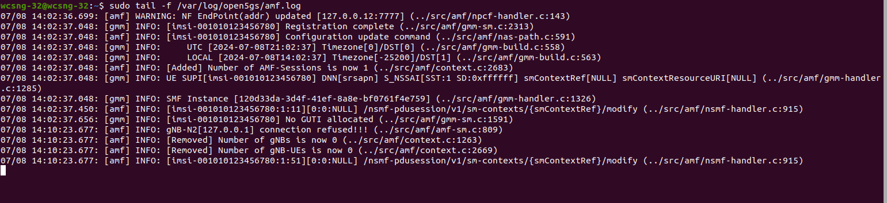
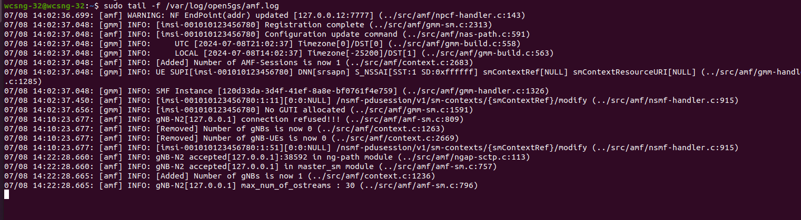
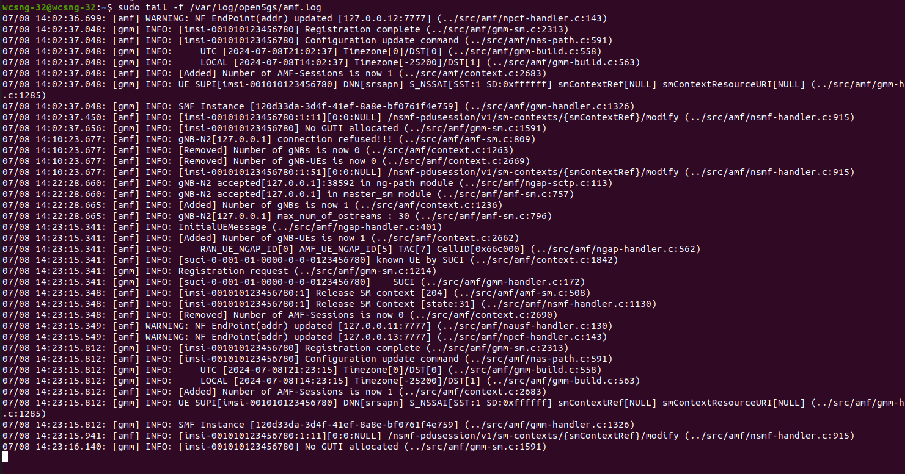
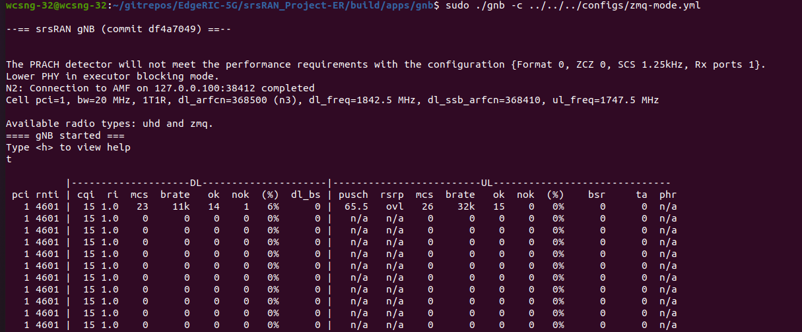
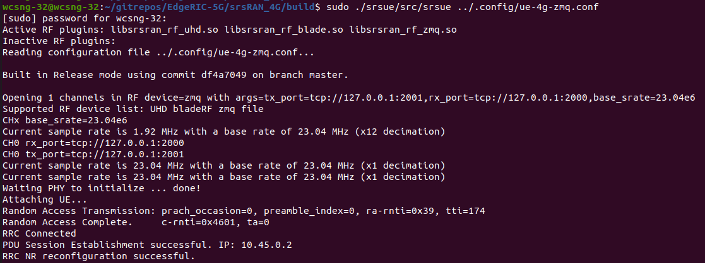

### Basic Log files under concern 
If you have any issue, please send me the following: CN - amf.log, nrf.log, smf.log, RAN - gnb.log, <your gnb config file>, <your UE config config file>  
Location of gnb.log --> ``/tmp/gnb.log``, for core network, see next section  
**Core Network Logs**   
Keep these logs running in the backround before you start the RAN to get a full trace of messages   
``sudo tail -f /var/log/open5gs/amf.log`` --> important to see whether gnb is connected to core network, and whether UEs are registered and authenticated  
*Other logs*  
``sudo tail -f /var/log/open5gs/nrf.log``  
``sudo tail -f /var/log/open5gs/smf.log``  

**What do you see when a network setup is succesful**  
Amf log when nothing is connected:

AMF log when RAN is started and gnb succesfully attaches to CN:

AMF log when the UE also attaches:

These messages indicate UE is successfully authenticated with CN:
```bash
07/08 14:23:15.341: [amf] INFO: [Added] Number of gNB-UEs is now 1 (../src/amf/context.c:2662)
07/08 14:23:15.341: [amf] INFO:     RAN_UE_NGAP_ID[0] AMF_UE_NGAP_ID[5] TAC[7] CellID[0x66c000] (../src/amf/ngap-handler.c:562)
07/08 14:23:15.341: [amf] INFO: [suci-0-001-01-0000-0-0-0123456780] known UE by SUCI (../src/amf/context.c:1842)
07/08 14:23:15.341: [gmm] INFO: Registration request (../src/amf/gmm-sm.c:1214)
07/08 14:23:15.341: [gmm] INFO: [suci-0-001-01-0000-0-0-0123456780]    SUCI (../src/amf/gmm-handler.c:172)
07/08 14:23:15.348: [amf] INFO: [imsi-001010123456780:1] Release SM context [204] (../src/amf/amf-sm.c:508)
07/08 14:23:15.348: [amf] INFO: [imsi-001010123456780:1] Release SM Context [state:31] (../src/amf/nsmf-handler.c:1130)
07/08 14:23:15.348: [amf] INFO: [Removed] Number of AMF-Sessions is now 0 (../src/amf/context.c:2690)
07/08 14:23:15.349: [amf] WARNING: NF EndPoint(addr) updated [127.0.0.11:7777] (../src/amf/nausf-handler.c:130)
07/08 14:23:15.549: [amf] WARNING: NF EndPoint(addr) updated [127.0.0.13:7777] (../src/amf/npcf-handler.c:143)
07/08 14:23:15.812: [gmm] INFO: [imsi-001010123456780] Registration complete (../src/amf/gmm-sm.c:2313)
07/08 14:23:15.812: [amf] INFO: [imsi-001010123456780] Configuration update command (../src/amf/nas-path.c:591)
07/08 14:23:15.812: [gmm] INFO:     UTC [2024-07-08T21:23:15] Timezone[0]/DST[0] (../src/amf/gmm-build.c:558)
07/08 14:23:15.812: [gmm] INFO:     LOCAL [2024-07-08T14:23:15] Timezone[-25200]/DST[1] (../src/amf/gmm-build.c:563)
07/08 14:23:15.812: [amf] INFO: [Added] Number of AMF-Sessions is now 1 (../src/amf/context.c:2683)
07/08 14:23:15.812: [gmm] INFO: UE SUPI[imsi-001010123456780] DNN[srsapn] S_NSSAI[SST:1 SD:0xffffff] smContextRef[NULL] smContextResourceURI[NULL] (../src/amf/gmm-handler.c:1285)
```
WHat do you see on gnb terminal?

Press ``t`` to see the trace, it will give you all UEs connected and the metrics
What do you see on UE terminal?

Press ``t`` to see the trace  
UE is successfully attached and connected to the network when you see the IP address is assigned.
